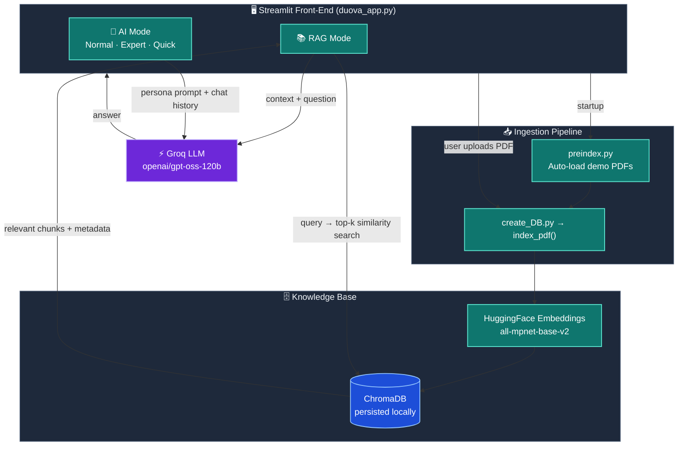
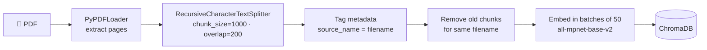
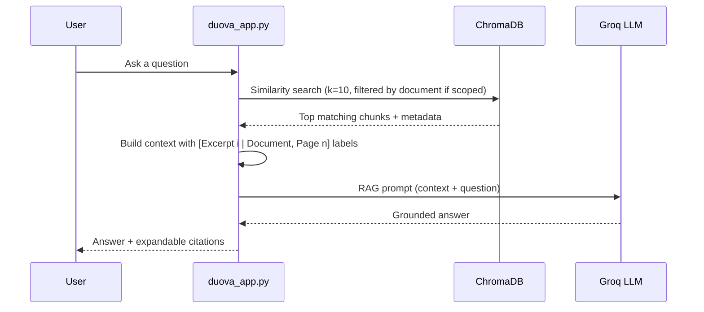

# 🌀 Duova AI — Hybrid RAG & Conversational Intelligence

Duova AI is a Streamlit web application that lets you **chat with your PDF documents** using Retrieval-Augmented Generation (RAG), and also switch to a **general-purpose AI assistant** with selectable personas.

Answers are grounded in your documents and come with **page-level citations**, so you can see exactly which excerpts the model used.

> **Demo-ready out of the box:** a sample PDF (`MIT_ML_Lec1.pdf`) is bundled in `preload_data/` and is indexed automatically on first launch. Visitors can start asking questions immediately, with no waiting for chunking or embedding, and can still upload their own PDFs.

---

## ✨ Features

### 📚 RAG Mode: Document Intelligence
- **Multi-PDF knowledge base**: upload several PDFs and query them together or one at a time.
- **Scoped search**: restrict questions to a single document, or search across all of them.
- **Page-level citations**: every answer includes expandable excerpts showing source file, page number, and text.
- **Live ingestion progress**: an animated 0–100% progress bar covers reading, chunking, embedding, and storing.
- **Smart deduplication**: re-uploading a file replaces its old chunks and leaves other documents untouched.
- **Document management**: view indexed documents, delete any of them, or clear the whole knowledge base from the sidebar.
- **Quick-start prompts**: one-click starters such as *Summarize Document* and *Key Concepts*.
- **Pre-loaded demo document**: the bundled PDF is indexed automatically on first run.

### 🤖 AI Mode: Reasoning Hub
Three persona-based chat modes with **separate, persistent conversation histories**:

| Persona | Behaviour |
|---|---|
| 💬 **Normal** | Friendly, clear, natural answers |
| 🧠 **Expert** | Technical, structured answers with headings, tables, and code blocks |
| ⚡ **Quick** | Ultra-concise, to-the-point bullets |

### 🎨 UI
Dark glassmorphic interface with custom typography (Sora, Plus Jakarta Sans, JetBrains Mono), a sidebar mode switcher, and auto-scrolling chat.

---

## 🏗️ Architecture

### High-level overview



### Ingestion flow (PDF → vector store)



### Query flow (RAG mode)



### Key design decisions

| Decision | Rationale |
|---|---|
| **Local embeddings** (`all-mpnet-base-v2`) | No embedding API cost, strong semantic quality, works offline once downloaded |
| **ChromaDB persisted to disk** | The index survives restarts and can be committed so deployments load instantly |
| **Chunk size 1000 / overlap 200** | Keeps enough context per chunk while preventing sentence loss at boundaries |
| **`source_name` metadata on every chunk** | Enables per-document filtering, deduplication, and deletion |
| **Pre-indexing the demo PDF** | Viewers get a working knowledge base instantly |
| **`st.cache_resource`** for model, vector store, and LLM | The embedding model loads once per server instead of on every interaction |
| **Groq-hosted LLM** | Very low inference latency for a responsive chat experience |

---

## 📁 Project Structure

```
RAG project/
├── duova_app.py        # 🌟 Main Streamlit app (RAG mode + AI mode UI)
├── create_DB.py        # PDF ingestion: load → chunk → embed → store in ChromaDB
├── preindex.py         # Auto-indexes PDFs from preload_data/ at app startup
├── main.py             # Terminal-based RAG chatbot (CLI version)
├── chatbot.py          # Terminal-based plain chatbot with 3 modes (no RAG)
├── requirements.txt    # Python dependencies
├── .gitignore          # Ignores .env, .venv, caches (keeps ChromaDB/ & preload_data/)
├── .env                # 🔒 API keys (NOT committed)
├── preload_data/       # Demo PDFs indexed automatically on first launch
│   └── MIT_ML_Lec1.pdf
└── ChromaDB/           # Persisted vector database (auto-generated)
```

### File responsibilities

| File | Role |
|---|---|
| **`duova_app.py`** | Web UI, session state, sidebar controls (mode switch, document scope, upload, delete), retrieval logic, prompt templates, citations, persona chat |
| **`create_DB.py`** | Exposes `index_pdf(pdf_path, progress_callback, embedding_model)`, which chunks a PDF, deduplicates, and stores embeddings in batches while reporting progress |
| **`preindex.py`** | Exposes `run_preindex()`, which compares PDFs in `preload_data/` with the filenames already in ChromaDB and indexes only the missing ones |
| **`main.py`** | Command-line RAG chat with an `upload` command, useful for quick testing without the UI |
| **`chatbot.py`** | Command-line chat with Normal / Expert / Quick personas and message history, a simple baseline without retrieval |

---

## 🧰 Tech Stack

| Layer | Technology |
|---|---|
| **Frontend** | Streamlit, custom CSS / HTML |
| **Orchestration** | LangChain (`langchain-core`, `langchain-community`, `langchain-text-splitters`) |
| **LLM** | Groq API, model `openai/gpt-oss-120b` (`langchain-groq`) |
| **Embeddings** | Hugging Face `sentence-transformers/all-mpnet-base-v2` (`langchain-huggingface`) |
| **Vector store** | ChromaDB (`langchain-chroma`) |
| **PDF parsing** | `pypdf` via `PyPDFLoader` |
| **Config** | `python-dotenv` |

---

## 🚀 Getting Started

### Prerequisites
- Python 3.10+
- A free [Groq API key](https://console.groq.com/keys)

### 1. Clone the repository
```bash
git clone <your-repo-url>
cd "RAG project"
```

### 2. Create and activate a virtual environment
```bash
python -m venv .venv

# Windows
.venv\Scripts\activate

# macOS / Linux
source .venv/bin/activate
```

### 3. Install dependencies
```bash
pip install -r requirements.txt
```

### 4. Configure environment variables
Create a `.env` file in the project root:

```env
GROQ_API_KEY=your_groq_api_key_here
```

> 🔒 `.env` is listed in `.gitignore`. Never commit your API keys.

### 5. Run the app
```bash
streamlit run duova_app.py
```

On first launch the app loads the embedding model (a one-time download of roughly 400 MB) and indexes the PDFs in `preload_data/`. After that, startup is instant.

> ⚠️ Run `duova_app.py`, **not** `main.py`. `main.py` is the terminal version and shows a warning if launched through Streamlit.

---

## 💡 Usage

### Web app
1. **Choose a mode** in the sidebar: **RAG** or **AI**.
2. **RAG mode**
   - Pick a document scope: *All Documents* or a single PDF.
   - Click **📁 Upload New PDF** to add your own files and watch the live progress bar.
   - Ask a question or click a quick-starter prompt.
   - Expand **📑 View Document Citations** under any answer to inspect the source excerpts.
   - Delete individual documents, or clear the whole knowledge base, from the sidebar.
3. **AI mode**
   - Choose a persona (Normal / Expert / Quick) and chat freely. Each persona keeps its own history.

### Command-line (optional)
```bash
python main.py       # RAG chat in the terminal (type 'upload' to add a PDF, '0' to exit)
python chatbot.py    # Plain chatbot with Normal / Expert / Quick modes
```

### Adding default demo documents
Drop any `.pdf` into `preload_data/` and restart the app. `preindex.py` detects files that are not yet in ChromaDB and indexes them automatically.

---

## ⚙️ Configuration Reference

| Setting | Location | Default |
|---|---|---|
| LLM model | `get_llm()` in `duova_app.py` | `openai/gpt-oss-120b` |
| Embedding model | `get_embedding_model()` in `duova_app.py` and `create_DB.py` | `sentence-transformers/all-mpnet-base-v2` |
| Chunk size / overlap | `create_DB.py` | `1000` / `200` |
| Retrieval `k` (scoped) | RAG query block in `duova_app.py` | `10` |
| Retrieval `k` (all docs) | RAG query block in `duova_app.py` | `12` |
| Embedding batch size | `create_DB.py` | `50` |
| Vector DB path | `persist_directory` | `ChromaDB/` |
| Demo PDF folder | `PRELOAD_DIR` in `preindex.py` | `preload_data/` |

> If you change the embedding model, delete the `ChromaDB/` folder and re-index. Vectors from different models are not compatible.

---

## 🔍 How It Works (Step by Step)

1. **Startup**: `duova_app.py` calls `run_preindex()`, which compares the PDFs in `preload_data/` against the `source_name` values stored in ChromaDB's SQLite file and indexes only what is missing.
2. **Ingestion**: `index_pdf()` loads the PDF page by page, splits it into overlapping 1000-character chunks, tags each chunk with its filename, removes any previous chunks for that file, and stores embeddings in batches.
3. **Retrieval**: when you ask a question, it is embedded and compared against the stored vectors (similarity search). With a single document selected, the search is filtered by `source_name`.
4. **Prompting**: the retrieved chunks are formatted as labelled excerpts (`[Excerpt i | Document: X, Page n]`) and inserted into the RAG prompt with your question.
5. **Generation**: the Groq-hosted LLM answers using only that context, and says so when the document lacks the information.
6. **Citations**: the same excerpts are shown under the answer so every claim can be verified.

---

## 🛣️ Possible Improvements

- Hybrid retrieval (BM25 + vector search). `rank-bm25` is already in `requirements.txt`.
- Re-ranking of retrieved chunks before generation.
- Support for DOCX and web pages (loaders such as `docx2txt` and `unstructured` are already installed).
- Streaming responses and conversational memory in RAG mode.
- Automated evaluation of answer quality, such as RAGAS.

---

## 📝 Notes

- `requirements.txt` also lists Google Gemini and Mistral packages. The current code uses **only Groq** for the LLM, so you can remove the unused ones to slim the install.
- The `ChromaDB/` and `preload_data/` folders are intentionally **not ignored** in `.gitignore`, so a deployment (for example Streamlit Community Cloud) starts with the demo knowledge base ready.
- On Streamlit Cloud, add `GROQ_API_KEY` under **App settings → Secrets** instead of using a `.env` file.

---

## 🙌 Acknowledgements

Built with [LangChain](https://www.langchain.com/), [ChromaDB](https://www.trychroma.com/), [Streamlit](https://streamlit.io/), [Hugging Face Sentence Transformers](https://www.sbert.net/), and [Groq](https://groq.com/).

---

## 📄 License

Add your license here (e.g., MIT).
